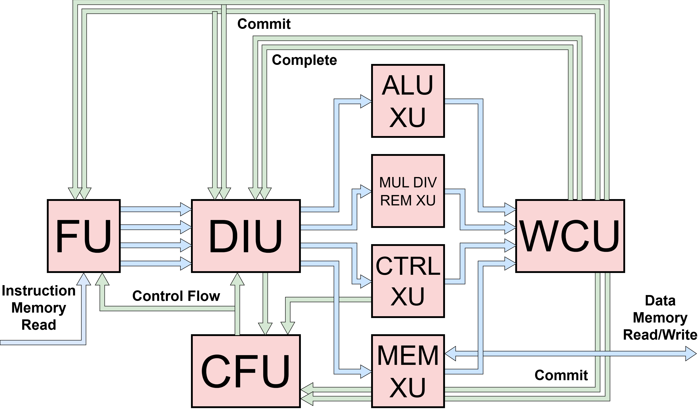

Processor Overview
==========================================================================

Zeppelin is implemented as a single top-level processor module
(``hw/top/Zeppelin.v``) parameterized to cover the full range of
configurations from a minimal single-issue core to a multi-lane superscalar
core with branch prediction and out-of-order issue queues.

Pipeline Composition
--------------------------------------------------------------------------

The Zeppelin toplevel instantiates the following units:

* A single :doc:`Fetch Unit (FU) </units/fetch_unit>` driving
  ``p_num_fe_lanes`` parallel ``F__DIntf`` interfaces toward the DIU
* A single :doc:`Decode-Issue Unit (DIU) </units/decode_issue_unit>` that
  receives ``p_num_fe_lanes`` instructions per cycle and drives
  ``p_num_pipes`` parallel ``D__XIntf`` interfaces toward the execute units
* ``p_num_alus`` parallel :ref:`ALU <xu-alu>` execute units
* ``p_num_muls`` parallel
  :ref:`multiply/divide/remainder <xu-muldivrem>` execute units, whose
  internal implementation (fully iterative, hybrid, or fully single-cycle)
  is selected by the ``p_muldivrem_sel`` parameter
* One :ref:`Load-Store Unit (LSU) <xu-lsu>` execute unit
* One :ref:`Control-Flow Execute Unit <xu-ctrl>` for conditional branches
* A single :doc:`Writeback-Commit Unit (WCU) </units/writeback_commit_unit>`
  that arbitrates the ``p_num_pipes`` completing pipes down to
  ``p_num_be_lanes`` backend commit lanes
* A single :doc:`Control-Flow Unit (CFU) </units/ctrl_flow_unit>` that
  arbitrates between control-flow redirect notifications from the DIU and
  the control-flow execute unit and broadcasts the winning redirect to the
  fetch unit and back to the DIU

The number of pipes ``p_num_pipes`` is derived as
``p_num_alus + p_num_muls + 2`` (the ``+ 2`` for the LSU and control-flow
execute units).

Toplevel Parameters
--------------------------------------------------------------------------

The full list of toplevel parameters and their defaults lives in
``hw/top/Zeppelin_defaults.vh`` and ``defs/UArch.v``. The most important
configuration knobs are summarized below.

.. list-table::
   :header-rows: 1
   :widths: 30 70

   * - Parameter
     - Purpose
   * - ``p_num_fe_lanes``
     - Width of the frontend fetch block; number of instructions decoded
       and renamed per cycle
   * - ``p_num_be_lanes``
     - Number of commit lanes out of the WCU per cycle; must be
       :math:`\leq 2^{p\_seq\_num\_bits}`
   * - ``p_num_alus`` / ``p_num_muls``
     - Number of replicated ALU and MUL/DIV/REM execute units
   * - ``p_seq_num_bits``
     - Width of the sequence-number space (also the ROB depth)
   * - ``p_num_phys_regs``
     - Size of the physical register file
   * - ``p_iq_depth``
     - Depth of each per-pipe issue queue
   * - ``p_pipe_bypass``
     - ``0``: only the control pipe is in bypass (combinational) mode;
       ``1``: all pipes are bypass-mode (no buffering)
   * - ``p_all_iq_in_order``
     - Force every issue queue to use the in-order variant regardless of
       pipe type
   * - ``p_muldivrem_sel``
     - ``0``: fully iterative MUL/DIV/REM; ``1``: single-cycle MUL with
       iterative DIV/REM; ``2``: fully single-cycle
   * - ``p_enable_branch_pred``
     - Enable the optional branch-target buffer in the fetch unit
   * - ``p_btb_entries`` / ``p_btb_ways``
     - Set-associative BTB size and associativity
   * - ``p_max_in_flight``
     - Maximum in-flight instruction-memory requests
   * - ``p_f_intf_fifo_depth``, ``p_x_intf_fifo_depth``,
       ``p_*_d_intf_fifo_depth``
     - Per-interface FIFO depths between major stages and at each execute
       unit input

Configurations Used in Evaluation
--------------------------------------------------------------------------

While the same RTL covers the full range of designs, the BRG MEng evaluation
focused on the following representative points:

* **Single-issue (1FE, 1BE).** ``p_num_fe_lanes = 1``, ``p_num_be_lanes = 1``,
  ``p_num_alus = 1``, ``p_num_muls = 1``. Roughly matches Blimp in area and
  performance; used as the modular-processor baseline.

* **Two-issue (2FE, 2BE).** ``p_num_fe_lanes = 2``, ``p_num_be_lanes = 2``,
  ``p_num_alus = 2``, ``p_num_muls = 2``. The pareto-optimal balance of
  area, energy, and performance; the recommended default.

* **Two-issue with out-of-order issue queues.** Same as 2FE/2BE, with
  ``p_all_iq_in_order = 0`` and issue-queue depth ``\geq 2`` so that the
  out-of-order ``IssueQueueOOO`` is instantiated on ALU and MUL pipes.

* **Wider configurations (3FE/3BE, 4FE/4BE).** Achievable by setting the
  lane counts higher, with diminishing performance returns. See the design
  sweeps and pareto frontiers in the project report for the tradeoff
  details.

The control-flow execute pipe is always in bypass mode (its issue queue is
forced to ``p_bypass = 1``) so that branches resolve in a single cycle, and
the memory pipe is always forced to use the in-order issue-queue variant
because the load-store unit does not contain a load-store queue.
