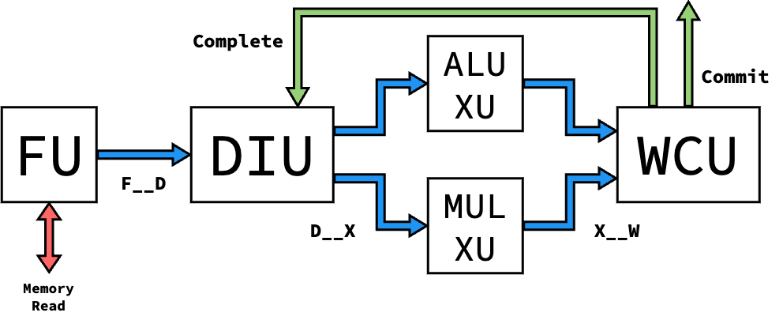
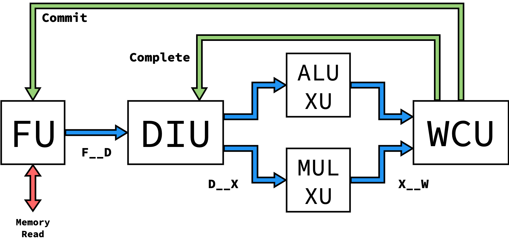
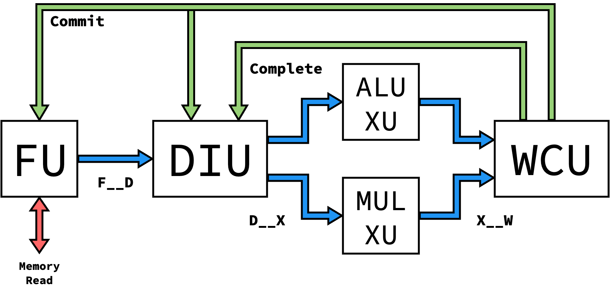
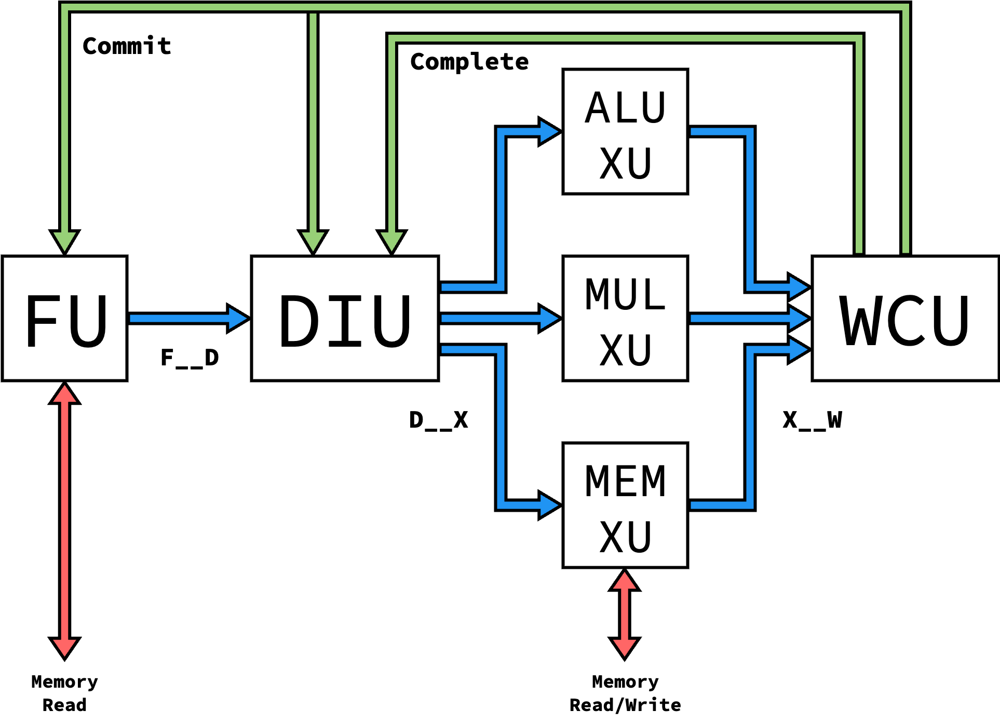
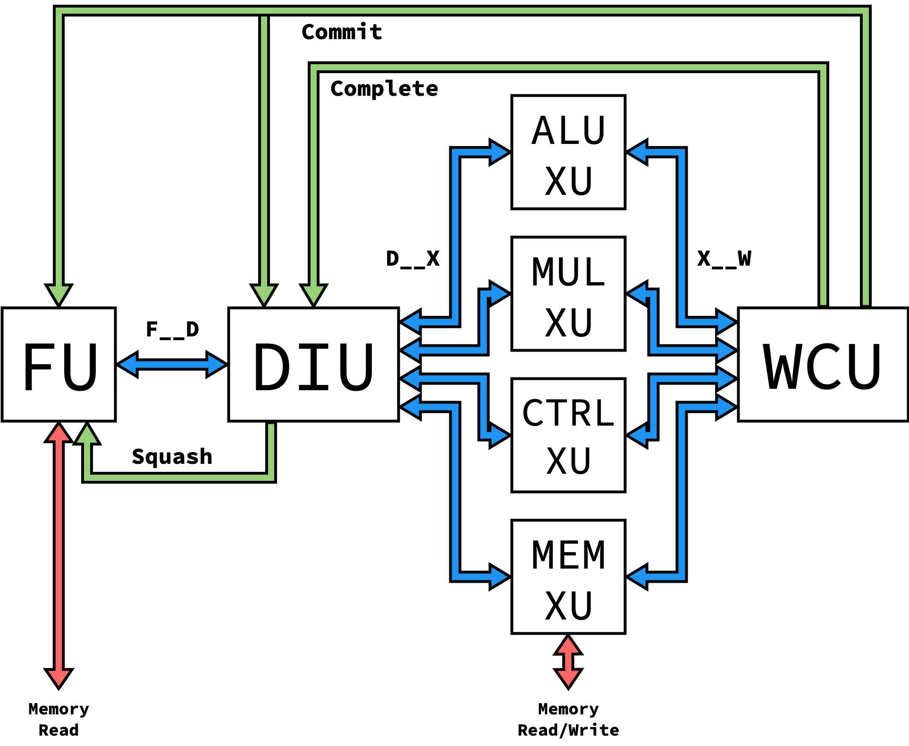
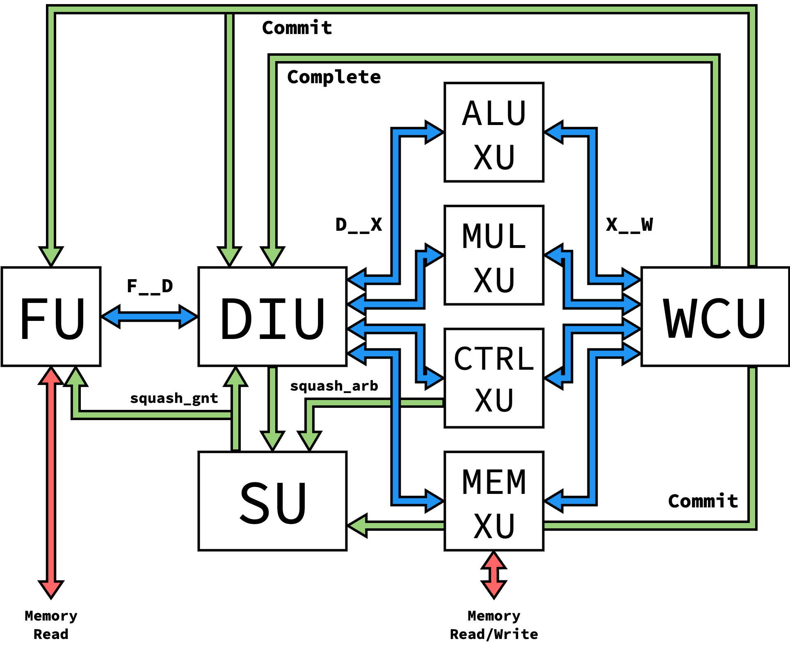
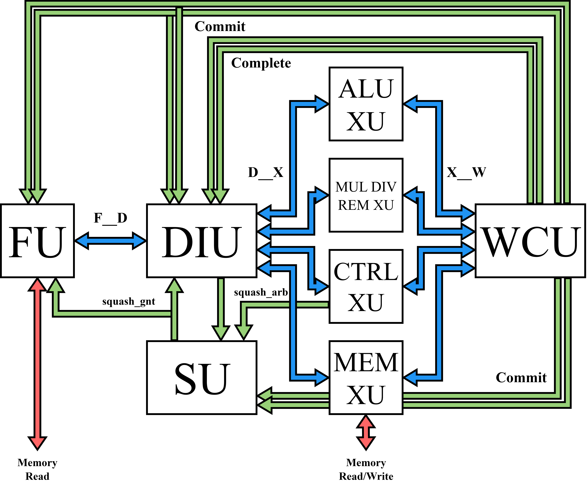
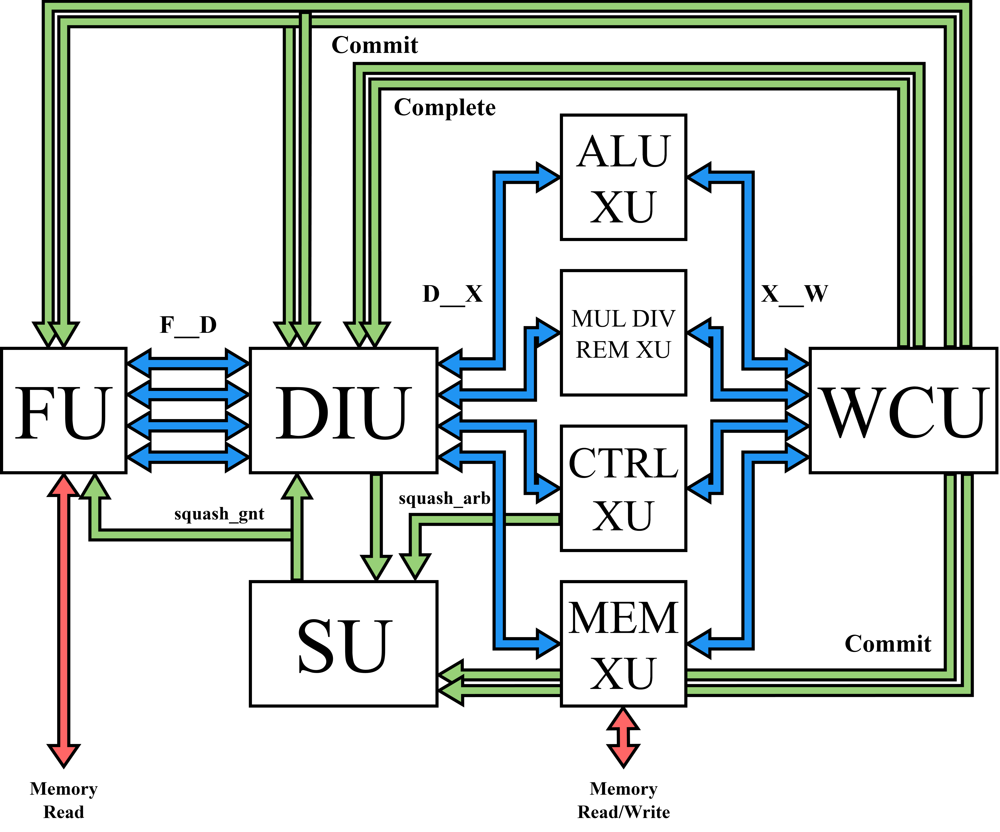

Processor Versions
==========================================================================

Zeppelin takes an iterative design approach, enabled through its modularity.
Different levels of Zeppelin's :doc:`microarchitectural units </units/units>`
can be composed to form different versions of Zeppelin processors. This
enables the design of these components to occur iteratively, adding on
functionality as the complexity of the processor progressed.

Currently, 11 versions of the processor are implemented. The table below
details the level of each unit that each processor version supports:

.. admonition:: Instruction Routing/Arbitration
   :class: note

   While specific levels of execute units may be supported at a given
   processor version, many levels aren't used in the given
   implementation, given that they are superseced by later levels with
   greater support

.. list-table::
   :header-rows: 1
   :stub-columns: 1
   :align: center

   * - Proc. Version
     - FU Level
     - DIU Level
     - XU Levels
     - WCU Level
     - SU Level
   
   * - V1
     - 1
     - 1
     - 1
     - 1
     -

   * - V2
     - 2
     - 2
     - 1, 2
     - 2
     -

   * - V3
     - 2
     - 3
     - 1, 2
     - 3
     - 

   * - V4
     - 2
     - 3
     - 1, 2, 3
     - 3
     - 

   * - V5
     - 3
     - 4
     - 1, 2, 3, 4
     - 3
     - 

   * - V6
     - 3
     - 5
     - 1, 2, 3, 4,
       5
     - 3
     - 1

   * - V7
     - 3
     - 5
     - 1, 2, 3, 4,
       5, 6
     - 3
     - 1

   * - V8
     - 3
     - 5
     - 1, 2, 3, 4,
       5, 6, 7
     - 3
     - 1

   * - V9
     - 4
     - 6
     - 1, 2, 3, 4,
       5, 6, 7
     - 4
     - 2

   * - V10
     - 4
     - 7
     - 1, 2, 3, 4,
       5, 6, 7
     - 4
     - 2

   * - V11
     - 5
     - 8
     - 1, 2, 3, 4,
       5, 6, 7
     - 4
     - 2

Version 1
--------------------------------------------------------------------------

The Version 1 processor is the simplest version, and aims to be the
baseline needed for assembly execution with modular units. Only three
instructions are supported (``add``, ``addi``, and ``mul``). The processor
is single-issue with in-order issue and completion, and assumes that
Execute Units are single-cycle to maintain instruction ordering.

.. admonition:: Instruction Routing/Arbitration
   :class: note

   To prepare for out-of-order implementations, the Level 1 DIU
   dynamically routes instructions to XUs based on availability, and the
   Level 1 WCU implements Round-Robin arbitration to select which XU to
   receive an instruction from. However, this isn't relevant based on
   the single-cycle guarantee of XUs, and could be replaced if needed
   for area.

Version 2
--------------------------------------------------------------------------

The Version 2 processor adds support for operations with variable latency
by modifying the DIU and WCU to reorder committing instructions based on
a sequence number, and to resolve WAW hazards through stalling in the
DIU. The FU is also modified to attach sequence numbers to instructions
when fetched. To demonstrate this, a pipelined multiply unit is
used as an XU to have intructions with varying latency.

.. admonition:: Sequence Number Generation
   :class: note

   The number of sequence numbers is a parameter for the overall processor,
   and represents how many instructions can be in-flight at once. This can
   be a fairly small value, as the number of in-flight instructions is also
   currently limited by processor pipeline depth. However, if the FU gets
   to a point where isn't doesn't have any more sequence numbers, it will
   stall until a sequence number is released through the associated
   instruction committing, communicated on the commit interface

Version 3
--------------------------------------------------------------------------

The Version 3 processor is similar to the Version 2 processor, but
introduces register renaming to resolve WAW hazards instead of stalling.
This requires modifying the DIU to include a rename table, as well as the
WCU to forward the physical register back to the DIU upon
completion/commit. Because of the commit interface indicating when a
physical register is freed, the DIU must now also listen to the commit
interface.

.. admonition:: Keeping track of the architectural register
   :class: note

   Strictly-speaking, we no longer need to propagate the architectural
   register specifier down the pipeline, as only physical registers are
   used after the DIU. However, we still maintain this to support
   backwards compatibility along the interfaces, as well as to be able
   to produce an architecturally-correct instruction trace upon commit
   for verification.

Version 4
--------------------------------------------------------------------------

The Version 4 processor adds support for memory operations, requiring
an additional XU to communicate with a memory interface.

Version 5
--------------------------------------------------------------------------

The Version 5 processor adds support for unconditional control flow
operations (i.e. jumps). This requires modifications to the DIU to
identify and act on jump instructions through the (newly-introduced)
squash interface, as well as modifications to the FU to redirect the
front of the pipeline and squash all in-flight fetches. We also need
an additional XU to propagate the jump instructions to commit, as well
as to store the return address when necessary (ex. ``JALR`` instructions).

Version 6
--------------------------------------------------------------------------

The Version 6 processor adds support for conditional control flow
instructions. These instructions are detected and acted on in a new XU,
which now interfaces with a squahs interface. Because control flow changes
can now come from either an XU or the DIU, we also need a new Squash Unit
(SU) to arbitrate between control flow changes based on sequence number.
This also requires a new DIU to detect when it's being squashed from an
XU.

.. admonition:: Instruction Routing/Arbitration
   :class: note

   Currently, our processor requires that the control flow XU acts on
   control flow instructions in one cycle. This simplifies the design by
   not allowing mistakenly-speculated instructions to get past the DIU,
   but isn't as modular as possible in design. An ideal implementation
   (discussed in :doc:`todo`) wouldn't impose this limitation, but would
   additionally require all other XUs and the WCU to listen to and act
   on a squash interface.

Version 7
--------------------------------------------------------------------------

The Version 7 processor adds new XUs to support all TinyRV2 instructions,
as specified in Cornell's `ECE 4750 <https://www.csl.cornell.edu/courses/ece4750/>`_.
This functionality is sufficient to run basic C code.

.. image:: img/versions-v7.png
   :align: center
   :width: 70%
   :alt: A picture of the Version 7 processor composition
   :class: bottompadding

Version 8
--------------------------------------------------------------------------

The Version 8 processor eadds new XUs to support the complete RV32IM ISA.
This functionality is sufficient to run complex C/C++ applications,
including games.

Version 9
--------------------------------------------------------------------------

The Version 9 processor supports superscalar backend, by using an m-select
arbiter in the WCU to select multiple completed instructions from XUs, as well
as a multi-ported ROB to intake multiple instructions from the arbiter as well
as commit multiple instructions. Modified versions of FU, DIU, and SU are also
required to support multiple completed and committed instructions with a new
sequence number generator (SeqNumGenL4), new sequence age tracker (SSSeqAge),
multi-rename table (SSRenameTableL1), and multi-write-ported register file
(MRegisterFile) as the complete and commit interfaces are now parameterized
based on the number of backend superscalar lanes (configurable at the toplevel).

Version 10
--------------------------------------------------------------------------

The Version 10 processor supports superscalar issue within the decode-issue unit
itself. As such, the high-level view of the processor without looking into the
units is identical to v9. all changes are internal to the DIU itself.
Superscalar issue is implemented using in-order issue queues accompanied by a
more intelligent instruction router which routes to the issue queue with fewer
enqueued instructions if multiple pipes can support the next instruction to
enqueue on the issue queues. Each issue queue thus contains instructions which
are waiting to execute. Since these queues are in-order, the entire queue is
blocked if the next instruction to dequeue is still waiting for its source
operands to be ready, which is tracked by looking up the register status in the
rename table and reading the source operands when ready from the register file.
Bypassing from the complete interface is also supported to allow for 1-cycle
issue latency. Any pipes supporting control-flow instrutions use a "bypass"
queue to keep the 1-cycle branch-resolution latency constraint.

Version 11
--------------------------------------------------------------------------

The Version 11 processor extends the superscalar backend of V10 with a
superscalar frontend, using FetchUnitL5 and DecodeIssueUnitL8. The fetch unit
fetches aligned blocks of ``p_num_fe_lanes`` instructions per cycle and
properly handles squashing into the middle of a fetch block by tracking a
``squash_restart_offset`` — only lanes at or above the offset in the first
post-squash fetch block are marked valid, while earlier lanes are invalidated
and do not receive sequence number allocations.

The DecodeIssueUnitL8 decodes ``p_num_fe_lanes`` instructions in parallel and
uses an SSRenameTableL3 that forwards destination register allocations within the
same fetch block: when looking up source operand physical registers for an
instruction, the rename table checks whether a previous lane in the same block
has already renamed the same architectural register, and if so, uses the
newly-allocated physical register instead of the stale mapping. This allows
back-to-back dependent instructions within a single fetch block to be decoded
correctly in the same cycle.

Instructions are routed from the ``p_num_fe_lanes`` input lanes to
``p_num_pipes`` output issue queues through a new SSInstXbar instruction
crossbar. The crossbar uses a modified iSLIP matching algorithm with age-based
priority for inputs (oldest instruction is granted first) and slot-based
priority for outputs (the pipe with the most available issue queue slots is
preferred), running multiple iterations per cycle for improved matching
efficiency. Each input instruction is matched to a compatible output pipe based
on its opcode, and the crossbar produces per-pipe routing indices that select
which lane's decoded instruction to enqueue.

