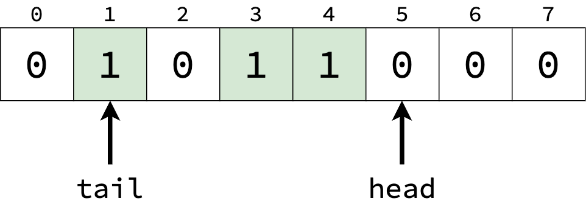
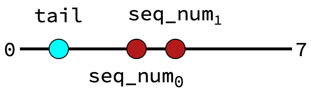

Sequence Numbers
==========================================================================

As part of the modular, out-of-order architecture, Zeppelin needs a way to
keep track of a global ordering between instructions. This is used to
reorder instructions in the WCU, as well as to compare ages of
instructions in the event of a squash.

This is implemented through the use of *sequence numbers*. Each
instruction is allocated a sequence number in the FU. This number
follows the instruction throughout the pipeline, and is used in the WCU
to reorder instructions. Once the instruction commits, the sequence
number is freed, and can be used again.

To understand sequence numbers, consider them as a range of values; in
this case, 0 - 7. The FU (responsible for allocating and freeing numbers)
can store these as an array; for any given number, a value of ``1`` at
that index indicates that the number is allocated, and a ``0`` indicates
that it's free.

In this example, the sequence numbers ``1``, ``3``, and ``4`` are 
allocated to in-flight instructions. This array acts as a FIFO buffer:

* When we allocate a sequence number, we allocate the entry that ``head``
  points to. The corresponding entry is set to ``1``, and the ``head``
  pointer increments
* When a sequence number is freed, the corresponding entry is set to ``0``
* The ``tail`` pointer indicates the oldest in-flight sequence number.
  When that entry is freed, ``tail`` can increment.

To avoid overlap, we can't allow ``head`` to increment enough to reach
``tail``; in this case, the allocation must wait until ``tail``
increments.

Age Logic
--------------------------------------------------------------------------

Since we know where ``tail`` is, we can also determine the relative age of
each sequence number. Let's first consider the case where both sequence
numbers are on the same "side" of the ``tail`` pointer:

Here, the comparison is simple; the older sequence number is the lesser
one (closest to the tail):

.. code-block:: sv

   assign 0_is_older = ( seq_num_0 < seq_num_1 );

However, let's now consider the case where sequence numbers wrap-around
(a.k.a. one sequence number is less than ``tail``, indicating we've
started allocating below where we're freeing):

Here, the comparison should be reversed; the lesser sequence number is
now younger, since it is less than ``tail``. The comparison should be
flipped for each sequence number that is less than the tail:

.. code-block:: sv

   assign 0_is_older = ( seq_num_0 < seq_num_1 ) ^
                       ( seq_num_0 < tail      ) ^
                       ( seq_num_1 < tail      );

Credit: `SonicBOOM <https://github.com/riscv-boom/riscv-boom/blob/7184be9db9d48bd01689cf9dd429a4ac32b21105/src/main/scala/v3/util/util.scala#L363>`_