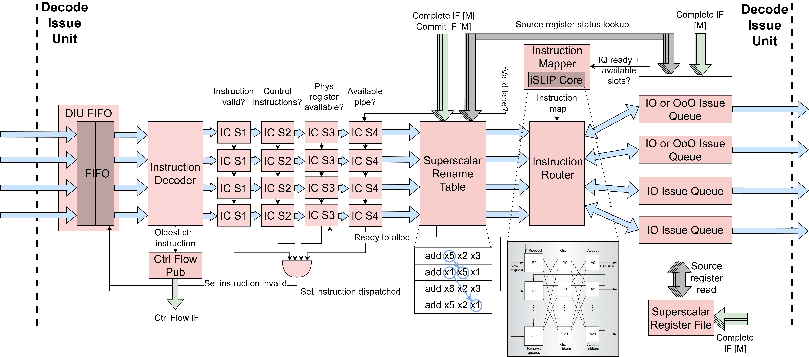

Decode Issue Unit (DIU)
==========================================================================

The Decode-Issue Unit (``DecodeIssueUnit``) decodes ``p_num_fe_lanes``
instructions per cycle in parallel, renames architectural registers to
physical registers, reads source operand values, and issues up to
``p_num_pipes`` instructions per cycle to the execute units via per-pipe
issue queues. Because all instructions in a fetch block travel together, the
DIU also identifies and handles control-flow instructions within the block
before any younger instructions in the same block are allowed to dispatch.

As shown in the diagram below, each frontend lane has its own
``InstDecoder`` and ``ImmGen`` instance (wrapped in ``SSDecoder``) that
decode the instruction word and generate the immediate value independently.
The ``SSRenameTable`` allocates physical registers for all lanes
simultaneously with inter-lane forwarding of destination register mappings
to handle intra-block dependencies. Instructions are then routed from the
``p_num_fe_lanes`` input lanes to the ``p_num_pipes`` output issue queues
via a two-stage crossbar: the ``SSInstMapper`` computes the lane-to-pipe
mapping using an iSLIP-based matching engine, and the ``SSInstRouter``
muxes instruction data according to the mapping. Each issue queue is either
the in-order ``IssueQueueInOrder`` or the out-of-order ``IssueQueueOOO``,
with its own register file read ports for independent operand resolution.

Instruction Window FIFO: DIUFifo
--------------------------------------------------------------------------

The DIU uses a ``DIUFifo`` to buffer fetched instruction blocks between the
fetch and decode-issue stages. The FIFO wraps a ``FifoBypass`` and presents
an instruction-window abstraction with per-lane editable head state. Each
lane in the head entry carries a 2-bit ``inst_status`` field with three
states: ``INVALID`` (``2'b00``), ``READY`` (``2'b01``), and ``DISPATCHED``
(``2'b10``).

The decode-issue pipeline reads the head entry each cycle and writes back
per-lane status edits: lanes that fail instruction checks for a terminal
reason are marked ``INVALID``, and lanes that successfully dispatch are
marked ``DISPATCHED``. These edits are maintained in shadow registers that
overlay the FIFO head entry and reset when the head is popped or the FIFO
is cleared. The head entry is popped (and the window advances) only when
every lane in the current entry is either invalid, dispatching this cycle,
or already dispatched, keeping all instructions in the fetch block together.

The FIFO is reset on ``ctrl_flow_sub.redirect_val`` (an external redirect
from an XU) and cleared on ``ctrl_flow_pub_val_comb`` (an internal redirect
from a JAL/JALR dispatch in the current window).

Instruction Check Stages
--------------------------------------------------------------------------

Dispatch eligibility is evaluated through four cascaded ``InstCheck`` stages
per lane, each gating on the result of the previous stage:

- **S1 -- Validity:** Checks that the FIFO entry is valid
  (``F_curr[i].val``), the instruction status is not ``INVALID``, and the
  decoder recognizes the instruction. This is the first filter and its
  ``pass`` output gates all subsequent stages.

- **S2 -- Control-instruction ordering:** Enforces ordering constraints
  around control-flow instructions (branches and jumps). The DIU scans
  the current window for the oldest undispatched control instruction
  (JAL/JALR/BRX) using wrap-around-safe sequence-number age comparisons
  via ``SSSeqAge``. For BRX instructions, younger instructions in the
  window are blocked from dispatching until the branch's source operands
  are ready and it can be dispatched. For JAL/JALR instructions, the
  oldest control instruction must be able to dispatch (pass S4) before
  younger instructions proceed. Instructions younger than the oldest
  control instruction are also blocked when a redirect is pending on
  ``ctrl_flow_sub``.

- **S3 -- Physical register allocation:** Checks that a free physical
  register is available for allocation (via ``alloc_rdy``) for
  instructions that write a destination register. Lanes are checked in
  order, with each lane gating on the previous lane's allocation success
  to prevent over-allocation.

- **S4 -- Structural hazard (crossbar routing):** Checks that the
  instruction was successfully routed to an issue queue by the
  ``SSInstMapper`` (i.e. the ``lane_val`` signal is asserted). Lanes
  are again checked in order to preserve dispatch ordering.

The ``invalidate`` outputs from the check stages are OR-reduced per lane
to determine whether to mark a lane ``INVALID`` in the instruction window.
Only terminal failures (e.g. the fetch unit already flagged the lane
``INVALID`` at S1, or the decoder did not recognize the instruction) lead
to ``INVALID``; transient failures (waiting on an older control-flow
instruction, free list empty, or losing the iSLIP grant this cycle) leave
the lane in its previous state so it re-runs the checks on the next cycle.

Control Flow Handling
--------------------------------------------------------------------------

Because multiple instructions are decoded simultaneously, the DIU must
handle the case where the current window contains control-flow instructions
alongside younger instructions that should not be issued. The DIU scans all
lanes each cycle to find the oldest undispatched control instruction
(JAL/JALR/BRX), tracking its lane index, sequence number, and whether it
is a branch (BRX) via ``oldest_ctrl_inst_found``, ``oldest_ctrl_inst_idx``,
and ``oldest_ctrl_inst_is_brx``.

For JAL/JALR instructions, when the oldest control instruction dispatches,
the ``DIUCtrlFlowPublisher`` computes the jump target and publishes a
redirect on the ``ctrl_flow_pub`` interface via the ``ControlFlowNotif``.
For JAL instructions, the target is ``PC + imm``; for JALR, the target is
``(rs1 + imm) & ~1``, where ``rs1`` is read from the control pipe's
register file port. When branch prediction is enabled, the publisher also
checks whether the JAL was already predicted taken (via the
``predicted_taken`` flag propagated from the fetch unit); if so, the
redirect is suppressed since the fetch unit is already fetching from the
correct target, and only a ``bp_update_val`` is asserted to confirm the
prediction to the branch predictor. For unpredicted JALs and all JALRs,
``redirect_val`` is asserted. The redirect signals are combinational,
relying on the downstream control-flow arbiter to break the combinational
loop back to the fetch unit.

The ``ctrl_flow_pub_val_comb`` signal is used internally to clear the
DIUFifo immediately when a jump dispatches.

For BRX instructions, the DIU checks whether the oldest control
instruction's source operands are ready by performing a rename-table
lookup through a dedicated port (port index ``p_num_pipes``). If the
sources are not ready, the S2 check blocks all instructions in the
window from dispatching, ensuring no instruction younger than an
unresolved branch is speculatively issued.

When a redirect arrives on the ``ctrl_flow_sub`` interface (from the
CFU), the FIFO is reset, discarding all instructions in the current
window.

Instruction-to-Pipe Mapper: SSInstMapper
--------------------------------------------------------------------------

The instruction-to-pipe mapper (``SSInstMapper``) computes a one-to-one
mapping from ``p_num_fe_lanes`` frontend lanes to ``p_num_pipes`` back-end
pipes using a shared ``ISLIPCore`` matching engine, which implements a
modified version of the iSLIP algorithm.

First, a compatibility matrix is computed: for each (input lane, output
pipe) pair, ``iq_compat_op`` is asserted when the instruction's micro-op
is supported by the pipe's ISA subset (via ``in_subset`` checks), the
instruction is valid, the queue is ready, and the queue has available
slots. For pipes with ``p_pipe_bypass`` set, compatibility additionally
requires that the instruction's source operands are both ready (since
bypass pipes issue combinationally with no buffering).

The matching is performed by ``ISLIPCore`` over ``p_num_iter`` iterations
(defaulting to ``p_num_fe_lanes``), each consisting of two phases:

- **Grant phase (age-based):** Each output pipe examines all compatible,
  unmatched inputs and grants to the oldest one, determined by an
  ``AgePE`` priority element using wrap-around-safe age comparison via
  the oldest committed sequence number from ``SSSeqAge``.

- **Accept phase (slot-based):** Each input lane examines all outputs
  that granted to it and accepts the one with the most available
  issue-queue slots, determined by a ``SlotsPE`` priority element. Ties
  are broken in favor of the lower-indexed pipe.

After each iteration, matched inputs and outputs are removed from
consideration (via ``input_free`` and ``output_free`` masks), and the
next iteration attempts to match the remaining unmatched ports. The
final match results across all iterations are OR-reduced to produce
per-pipe ``iq_val`` and ``route_idx`` signals (selecting which lane
feeds each pipe) and per-lane ``lane_val`` and ``lane_to_pipe_map``
signals (indicating which pipe the lane was matched to, if any).

Data Router: SSInstRouter
--------------------------------------------------------------------------

The ``SSInstRouter`` is a pure data router that muxes per-lane
instruction data to per-pipe outputs based on the mapping produced by
``SSInstMapper``. It consumes the ``route_idx``, ``iq_val``, and
``lane_to_pipe_map`` signals from the mapper and produces per-pipe
``iq_msg`` and ``iq_ins_try`` outputs for the issue queues. It also
computes ``dispatch_go`` per lane, which is asserted when the lane
passes all instruction checks and the target issue queue is ready.

Issue Queue Selection and Configuration
--------------------------------------------------------------------------

Each pipe's issue queue type is determined by a set of configuration
parameters:

- **``p_pipe_bypass``:** When set to 1, all pipes use bypass-mode issue
  queues (``IssueQueueInOrder`` with ``p_bypass=1``); when 0 (the
  default), only the control-subset pipe (the one whose ISA subset
  exactly matches ``p_ctrl_subset``) uses bypass mode.

- **``p_mem_subset``:** Defines the memory instruction subset. Pipes
  whose ISA subset intersects ``p_mem_subset`` are automatically forced
  to use in-order issue queues, since there is no load-store queue in
  the memory execute unit.

- **``p_all_iq_in_order``:** When set, all issue queues use in-order
  issue regardless of pipe type.

Pipes that are neither bypass nor forced in-order use the out-of-order
``IssueQueueOOO`` described below.

In-Order Issue Queue: IssueQueueInOrder
--------------------------------------------------------------------------

The in-order issue queue (``IssueQueueInOrder``) is a circular FIFO that
buffers decoded instructions and issues them to the execute stage strictly
in program order once both source operands are ready. Each issue queue has
its own pair of rename-table lookup ports and register-file read ports,
enabling independent operand resolution per queue.

The queue maintains insert and dequeue pointers (``ins_ptr`` and
``deq_ptr``) to manage its circular buffer of entries. On insertion, the
instruction's decoded fields (micro-op, physical register addresses,
immediate, PC, sequence number, etc.) are stored at the insert pointer. The
``avail_slots`` output communicates the remaining capacity to the
``SSInstMapper`` for load-balancing decisions.

On the dequeue side, the queue looks up the source physical registers of
the head-of-queue instruction in the rename table via the
``rt_lookup_pending`` signals. If neither source operand is pending (both
ready), the queue asserts the dequeue handshake and drives the operand
values read from the register file onto the execute interface, along with
the rest of the instruction fields. In-order issue is enforced by only
ever considering the instruction at the dequeue pointer for issue.

The queue also supports a same-cycle bypass path: when the queue is empty
and both the insert and dequeue handshakes are active simultaneously, the
incoming instruction can bypass the entry storage entirely and be issued
directly to the execute stage, avoiding the one-cycle latency of writing
to and reading from the queue. When ``p_bypass`` is set, the queue
operates in a fully stateless mode, acting as a combinational pass-through
that gates the instruction based solely on operand readiness, with no
internal storage. This bypass mode is what the control-flow pipe uses to
keep branch resolution to a single cycle.

Out-of-Order Issue Queue: IssueQueueOOO
--------------------------------------------------------------------------

The out-of-order issue queue (``IssueQueueOOO``) is a drop-in alternative
to ``IssueQueueInOrder`` that dequeues the oldest ready instruction rather
than blocking on the in-order head. Source operand pending status is
provided at insert time and tracked internally; the queue monitors
completion notifications to clear pending bits, removing the need for
rename-table lookups at dequeue.

The queue maintains a flat array of entries with per-entry valid bits and
per-entry source pending bits. On insertion, a free slot is selected via
a priority encoder. On dequeue, the queue computes per-entry readiness
(both sources not pending, with same-cycle completion bypass) and selects
the oldest ready entry using XOR-based wrap-around-safe age comparison
against the ``oldest_seq_num`` from ``SSSeqAge``. An entry ``j`` is
considered older than entry ``i`` when
``(seq[j] < seq[i]) ^ (seq[j] < oldest) ^ (seq[i] < oldest)``. The
oldest ready entry is priority-encoded to produce the dequeue index.

Like ``IssueQueueInOrder``, the OOO queue supports a same-cycle bypass
path when the queue is empty, issuing the incoming instruction directly
if its sources are ready. When ``p_bypass`` is set, the queue operates in
fully stateless bypass mode, identical to the in-order bypass behavior.

Sequence Age Tracker: SSSeqAge
--------------------------------------------------------------------------

The ``SSSeqAge`` module (in ``hw/util/``) tracks the oldest committed
sequence number by monitoring the commit interface. This value is shared
across the DIU and the CFU/WCU arbiters to provide consistent
wrap-around-safe age comparisons. See :doc:`/uarch/seq_nums` for the
underlying algorithm.

Register File: SSRegfile
--------------------------------------------------------------------------

The physical register file is implemented by a single shared ``SSRegfile``
instance with ``p_num_pipes`` lookup ports, one per backend pipe so that
every pipe can independently read its source operands. The register file
also has ``p_num_be_lanes`` write ports driven by the completion interface
from the WCU, one write port per backend lane.

Rename Table: SSRenameTable
--------------------------------------------------------------------------

The ``SSRenameTable`` supports ``p_num_fe_lanes`` simultaneous allocations
with inter-lane destination register forwarding. The core data structures
-- a 31-entry rename table mapping architectural registers to physical
registers with pending bits, and a free list tracking available physical
registers -- are unchanged from a single-lane rename table.

For multi-lane allocation, each lane has its own ``PriorityEncoder`` that
selects the first free physical register from the free list. To prevent
multiple lanes from allocating the same physical register, lane ``i``'s
priority encoder input filters out any physical register already selected
by lanes ``0`` through ``i-1``, creating a forward dependency chain across
lanes.

The key addition over a single-lane rename table is destination register
forwarding during source operand lookup. When lane ``k`` looks up the
physical register for a source architectural register, it first reads the
current mapping from the rename table, then checks whether any previous
lane ``m`` (where ``m < k``) in the same fetch block is allocating a new
physical register for the same architectural register. If so, lane ``k``
uses lane ``m``'s newly-allocated physical register instead of the stale
table entry. This ensures that within a single fetch block, a later
instruction correctly reads from the destination of an earlier instruction
(e.g. ``add x1, x2, x3`` followed by ``add x4, x1, x5`` in the same block
will have the second instruction's ``x1`` source point to the physical
register just allocated by the first instruction).
