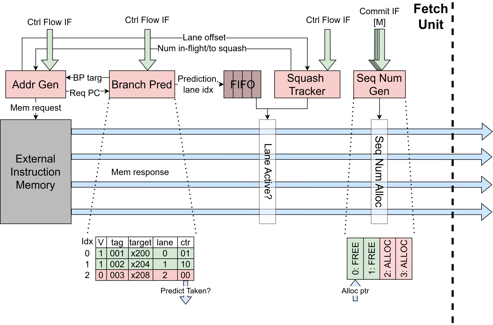

Fetch Unit
==========================================================================

The Fetch Unit (``FetchUnit``) is a FIFO-less superscalar fetch unit that
fetches aligned blocks of ``p_num_fe_lanes`` instructions per cycle and
supports control-flow redirects from downstream units. As shown in the
diagram below, the fetch unit sends a single wide memory request per cycle
and the response data is unpacked into ``p_num_fe_lanes`` instruction lanes
that flow directly to the ``F__DIntf`` with no internal buffering. When a
control-flow redirect occurs, the unit tracks all in-flight requests via
``num_to_squash`` and drops them as they return from memory, then restarts
fetching from the redirect target address. The redirect target is decomposed
into a fetch-block base address (aligned to ``p_num_fe_lanes`` words) and a
lane offset within that block, which determines which lanes in the first
post-redirect fetch block carry valid instructions.

Each lane carries a 2-bit ``inst_status`` field (``READY`` or ``INVALID``) on
the ``F__DIntf`` interface. Lanes with valid instruction data are marked
``READY``; lanes that should be ignored (e.g. before the restart offset or
during a stale-response drop) are marked ``INVALID``. The downstream
decode-issue unit uses this status to skip invalid lanes without additional
checking. Each lane also carries a ``predicted_taken`` flag (described below)
that the decode-issue unit uses to suppress redirect publication for
correctly-predicted JAL instructions.

Address Generator: FetchAddrGen
--------------------------------------------------------------------------

The ``FetchAddrGen`` module maintains the current fetch-block base address
and produces the memory request address and valid signal. It handles three
address sources in priority order: (1) a control-flow redirect from the
``ControlFlowNotif`` interface, which always takes priority and computes a
block-aligned base address from the redirect target; (2) a branch-predictor
redirect (when ``p_enable_branch_pred`` is set), which steers the next fetch
to the predicted target; and (3) sequential fetch, which advances the base
address by ``p_num_fe_lanes * 4`` bytes after each completed request.

For redirects, ``FetchAddrGen`` decomposes the redirect address into a
fetch-block base address and a ``ctrl_flow_lane_offset`` indicating which
lane within the block the redirect corresponds to. For not-taken
mispredictions, the module redirects to ``PC + 4`` (the fall-through
address) instead of the branch target. The request-valid signal is gated by
the ``num_in_flight`` and ``num_to_squash`` counts to prevent exceeding the
maximum number of in-flight requests.

Control Flow Redirect Tracker: FetchSquashTracker
--------------------------------------------------------------------------

The ``FetchSquashTracker`` tracks the number of in-flight fetch requests and
the number of stale responses that must be drained after a control-flow
redirect. It maintains two counters: ``num_in_flight`` (incremented on each
memory request, decremented on each consumed response) and ``num_to_squash``
(set to the current in-flight count on a redirect, decremented as stale
responses arrive). The ``should_drop`` output is asserted when a redirect is
active or stale responses remain, causing the datapath to discard incoming
memory responses.

After a redirect, the first valid fetch block may start at a mid-block lane.
The ``needs_ctrl_flow_restart`` flag tracks whether the next good block
needs lane masking, and ``ctrl_flow_restart_offset`` records which lane to
start from. These signals persist until the first valid fetch block is
transferred to decode, after which all subsequent fetch blocks use all
lanes normally.

Branch Predictor: BranchPredictor
--------------------------------------------------------------------------

When the ``p_enable_branch_pred`` parameter is set, the fetch unit
instantiates a ``BranchPredictor`` that predicts whether a fetch block
contains a taken branch and, if so, redirects the next fetch to the
predicted target. The predictor uses a set-associative Branch Target
Buffer (BTB) with ``p_btb_entries`` entries and ``p_btb_ways`` ways
(``p_btb_ways=1`` gives direct-mapped, ``p_btb_ways=p_btb_entries`` gives
fully-associative). Each BTB entry stores a tag, target address, 2-bit
saturating counter for direction prediction, and the lane index of the
branch within the fetch block. FIFO replacement is used when all ways in
a set are occupied.

On each fetch request, the predictor looks up the BTB using the fetch-block
base address. If a matching entry is found and the counter's MSB is set
(predicting taken), the predictor asserts ``redirect_val`` and drives
``redirect_target`` with the BTB's stored target, causing ``FetchAddrGen``
to steer the next fetch to the predicted address. The ``pred_taken`` and
``branch_lane`` signals are pushed into a prediction FIFO alongside the
fetch request so that the correct prediction metadata accompanies the
memory response when it returns.

On the response side, the prediction FIFO is popped, and lanes beyond the
predicted branch lane are marked inactive (``lane_active`` is deasserted),
preventing the fetch unit from sending instructions that follow a
predicted-taken branch. The ``predicted_taken`` flag on the ``F__DIntf`` is
set for the branch lane itself, allowing the decode-issue unit to recognize
that the JAL was predicted and suppress a redundant redirect.

Updates to the BTB arrive via the ``ControlFlowNotif`` interface when a
branch or JAL resolves at execute time. The ``bp_update_val`` signal
triggers the update, which increments or decrements the saturating counter
for existing entries, or allocates a new entry (initializing the counter to
weakly-taken or weakly-not-taken) on a miss.

Sequence Number Generator: SeqNumGen
--------------------------------------------------------------------------

The ``SeqNumGen`` module manages a circular buffer of ``2^p_seq_num_bits``
sequence numbers using a head and tail pointer. Each cycle, it can allocate
up to ``p_num_fe_lanes`` consecutive sequence numbers from the head pointer
for newly fetched instructions. Committed instructions are marked free via
the commit interface, and the tail pointer advances in-order over
consecutive free entries, reclaiming up to ``p_reclaim_width`` entries per
cycle. On a control-flow redirect, all sequence numbers younger than the
redirect sequence number are freed and the head pointer resets to
``ctrl_flow.seq_num + 1``. Allocation can occur simultaneously with a
redirect -- the new sequence numbers start from the post-redirect head
pointer position.

When the redirect target address is aligned to the base of a fetch block
(i.e. the lane offset is zero), the restart is straightforward. The fetch
unit begins requesting the aligned fetch block starting at the redirect
target, and since the target corresponds to lane 0, all lanes in the first
post-redirect fetch block contain valid instructions. The
``ctrl_flow_restart_offset`` is zero, so ``D_inst_status`` and
``alloc_rdy`` are asserted for every lane, and each lane receives a
sequence-number allocation as normal.

When the redirect target address falls in the middle of a fetch block
(i.e. the lane offset is nonzero), the fetch unit still fetches the entire
aligned block but must invalidate the lanes before the target. The
``ctrl_flow_restart_offset`` register captures which lane the redirect
target corresponds to, computed as the word offset within the fetch block.
On the first post-redirect fetch block, ``D_inst_status`` is set to
``READY`` and ``alloc_rdy`` is asserted only for lanes at or above
``ctrl_flow_restart_offset`` -- earlier lanes are marked ``INVALID`` and
do not receive sequence-number allocations. The ``needs_ctrl_flow_restart``
flag ensures this partial-block behavior persists until the first valid
fetch block is transferred to decode, after which all subsequent fetch
blocks use all lanes normally.

For more on the semantics of sequence numbers and their use in age
comparisons throughout the rest of the pipeline, see
:doc:`/uarch/seq_nums`.
