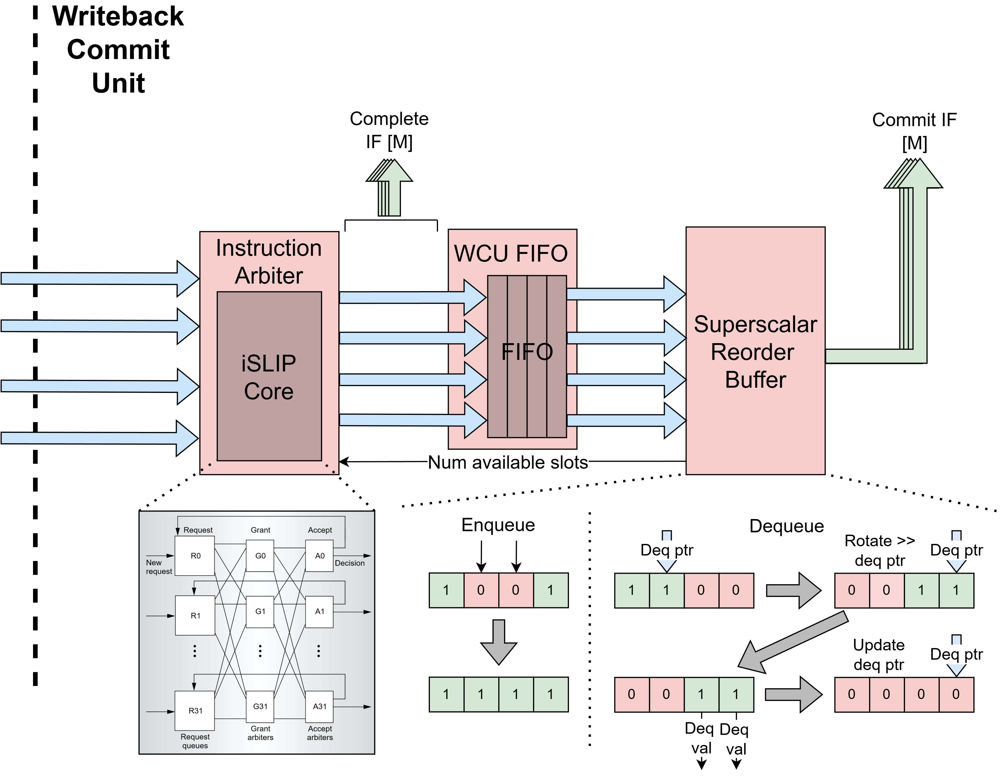

Writeback Commit Unit (WCU)
==========================================================================

The Writeback-Commit Unit (``WritebackCommitUnit``) arbitrates between
completed instructions arriving from the execute units, reorders them into
original program order, and commits them to update the architectural state
in the register file. The WCU accepts up to ``p_num_pipes`` completing
instructions per cycle (one from each pipe in the backend) and commits up
to ``p_num_be_lanes`` instructions per cycle.

The unit is structured as a two-stage pipeline. The first stage arbitrates
between the ``p_num_pipes`` completing pipes to pick up to
``p_num_be_lanes`` of them and broadcasts the selected instructions'
writeback data over ``CompleteNotif`` to the rename table and register
file in the DIU so that dependent instructions waiting in the issue queues
can be marked ready as soon as possible. The second stage enqueues those
selected instructions into the multi-reorder buffer (``SSROB``), which
holds them until they can be dequeued and committed in program order.

Age-Based Instruction Arbiter: SSWCUArb
--------------------------------------------------------------------------

The age-based arbiter (``SSWCUArb``) selects up to ``m`` of the oldest
requesting pipes each cycle using the same ``ISLIPCore`` matching engine
that the decode-issue unit's instruction mapper uses. This makes the
WCU's arbiter the natural analog of the DIU's mapper, only routing in the
opposite direction (from ``p_num_pipes`` input pipes to ``p_num_be_lanes``
output backend lanes).

``SSWCUArb`` builds a compatibility matrix where every valid pipe is
compatible with every backend lane (any completed instruction can be
packed into any output lane), then limits the number of active output
lanes via an ``output_free_init`` mask derived from the number of
available instructions to arbitrate (``avail_slots_arb``, computed as
the minimum of the SSROB's available slots and ``p_num_be_lanes`` and
gated to zero when the decoupling FIFO is full). ``ISLIPCore`` then
performs the matching using an age-based grant phase (each output lane
grants to the oldest requesting pipe via ``AgePE``) and a lowest-index
accept phase (each pipe accepts the lowest-indexed output lane that
granted to it). Age comparison uses ``SSSeqAge`` with the oldest
committed sequence number for wrap-around-safe ordering.

After matching, granted pipes are packed into sequential output lanes
and ready signals are driven back to the execute interfaces so the
granted pipes can advance to their next completing instruction.

An earlier multi-select round-robin arbiter (``MRRArb``) based on
`this paper <https://ieeexplore.ieee.org/stamp/stamp.jsp?tp=&arnumber=6673286>`_
was the original implementation, but ``SSWCUArb`` replaced it once the
iSLIP-based crossbar was already required on the decode-issue side --
sharing one matching engine across both ends of the pipeline reduced
overall complexity and gave the WCU age-aware arbitration for free.

Decoupling FIFO: WCUFifo
--------------------------------------------------------------------------

The ``WCUFifo`` is a multi-lane FIFO that sits between the arbiter output
and the SSROB so the two stages can operate without back-pressuring each
other. The FIFO wraps a generic ``Fifo`` and packs all ``p_num_be_lanes``
lanes into a single FIFO entry, with the depth set by the
``p_x_intf_fifo_depth`` parameter. The FIFO is pushed whenever any
selected instruction is valid and there is space, and popped whenever it
is not empty.

Importantly, the completion notifications that broadcast writeback data
back to the rename table and register file in the decode-issue unit are
driven directly from the arbiter output (before the FIFO) rather than
from the FIFO output. This minimizes the latency of communicating
writeback results to the issue queues so that dependent instructions can
be marked ready and dispatched on the same cycle that the completing
instruction is selected by the arbiter, without having to wait for it to
drain through the FIFO first.

Multi-Reorder Buffer: SSROB
--------------------------------------------------------------------------

The multi-reorder buffer (``SSROB``) stores instructions received from
the FIFO and commits them back in program order to the rename table. It
is similar to a traditional ROB but extended to allow multiple enqueues
and dequeues per cycle, with the additional ability to bypass an
enqueued instruction directly to a dequeue in the same cycle for the
case where the entry being enqueued is exactly the one needed to make
the dequeue range contiguous.

Supporting multiple enqueues is straightforward since the SSROB uses
multiple write ports indexed by the sequence number of the instruction
being enqueued. Only one in-flight instruction can carry a given
sequence number at a time, so write conflicts cannot occur between
simultaneously enqueueing instructions.

Supporting multiple dequeues is more complex. Instructions can complete
and arrive in the ROB out of order, so the entries starting at the
dequeue pointer may not all be valid in a single cycle. Additionally,
instructions enqueueing on the current cycle may fill exactly the gaps
that would otherwise block a dequeue, allowing those instructions to
be dequeued in the same cycle so long as they are bypassed past the
entry registers.

To handle both of these cases together, the SSROB maintains a set of
shadow registers that represent what the ROB entries would look like
if the current cycle's enqueues had already been written to their
respective entries. This shadow view is then used to determine how many
contiguous valid entries exist starting from the dequeue pointer. To
avoid expensive wrap-around calculations when the dequeue range crosses
the end of the buffer, the shadow valid bits are rotated and packed so
that the least significant bit corresponds to the entry at the dequeue
pointer. This reduces the dequeue-range problem to a linear iteration
from the LSB, where edge detection identifies the first 1-to-0
transition in the valid bits, which indicates the first invalid entry
and therefore where dequeuing must stop. The thermo-encoded
representation of this edge, further limited by ``p_num_be_lanes``,
gives the bitmask of entries to dequeue this cycle, and the index of
the first invalid entry advances the dequeue pointer for the next
cycle. The number of available SSROB slots, fed back as
``avail_slots`` to the arbiter to cap how many new instructions can be
selected, is computed by counting the entries whose valid bits are
not set.
