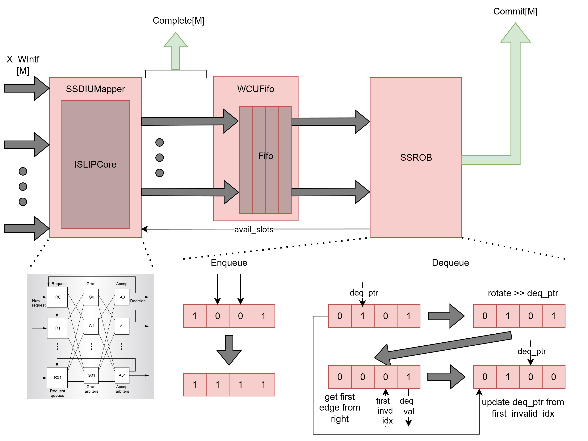

Writeback Commit Unit (WCU)
==========================================================================

WritebackCommitUnit L4
--------------------------------------------------------------------------

The level 4 Writeback Commit Unit (WCU L4) is responsible for arbitrating
between completed instructions from multiple execute units (XUs) and reordering
them for in-order commit, just as the previous versions. However, the L4 WCU
supports a superscalar architecture, allowing it to arbitrate multiple completed
instructions to send to the ROB, which, in turn, can also commit multiple
instructions in the same cycle.

The WCU L4 pipeline consists of three main stages: (1) arbitration and
selection, which picks up to ``p_num_be_lanes`` completed instructions from the
``p_num_pipes`` execute pipes; (2) completion notification, which broadcasts
the selected instructions' write-back data to the decode-issue unit's rename
table and register file before entering the FIFO; and (3) reorder and commit
via the SSROB, which buffers instructions and dequeues them in program order.

The arbiter is configurable via the ``p_use_age_arb`` parameter: when set (the
default), the age-based ``SSWCUArb`` is used; when cleared, the round-robin
``MRRArb`` is used instead. Both arbiters receive a budget
(``avail_slots_arb``) computed as the minimum of the SSROB's available slots and
the number of backend lanes, capped further when the bypass FIFO is full. A
``WCUFifo`` sits between the arbiter output and the SSROB, decoupling
the arbitration stage from the reorder buffer.

Age-Based Instruction Arbiter: SSWCUArb
~~~~~~~~~~~~~~~~~~~~~~~~~~~~~~~~~~~~~~~~~~~~~~~~~~~~~~~~~~~~~~~~~~~~~~~~~~

The age-based arbiter (SSWCUArb) selects up to ``m`` of the oldest requesting
pipes each cycle using the shared ``ISLIPCore`` matching engine. It is the
default arbiter for the WCU L4 and is analogous to the ``SSInstMapper`` used on
the decode-issue side, but routing in the opposite direction (N pipes -> M
backend lanes).

SSWCUArb builds a compatibility matrix where every valid pipe is compatible with
every backend lane, then limits the number of active output lanes via an
``output_free_init`` mask derived from the ``m`` budget. ``ISLIPCore`` performs
the matching using an age-based grant phase (each output lane grants to the
oldest requesting pipe via ``AgePE``) and a lowest-index accept phase (each pipe
accepts the lowest-indexed output lane that granted to it). Age comparison uses
``SSSeqAge`` with the oldest committed sequence number for wrap-around-safe
ordering.

After matching, granted pipes are packed into sequential output lanes and ready
signals are driven back to the execute interfaces.

Round-Robin Instruction Arbiter: MRRArb
~~~~~~~~~~~~~~~~~~~~~~~~~~~~~~~~~~~~~~~~~~~~~~~~~~~~~~~~~~~~~~~~~~~~~~~~~~

The multi-round-robin arbiter (MRRArb) is the alternative arbiter, selected
when ``p_use_age_arb`` is 0. It selects multiple completed instructions from
multiple XUs using a round-robin priority scheme. `This paper
<https://ieeexplore.ieee.org/stamp/stamp.jsp?tp=&arnumber=6673286>`_ describes
an implementation for an m-select round-robin arbiter, which performs exactly
the operation desired for this case, albeit with a fixed number of instructions
to output at once. Our implementation is based on this design, but modified
to allow for a variable number of instructions to be selected based on the
number of available slots in the SSROB, which is communicated to the arbiter
as the ``avail_slots`` signal seen in the above diagram.

The paper describes the implementation in detail. The design is centered around
two m-select priority encoders, which select up to ``m`` inputs from a set of
``n`` inputs based on a priority scheme. This is done by using a saturated sum,
which iterates through each input request and adds to a running total of
requests until it hits a maximum of ``m`` requests, at which point it stops
adding to the total. From the sum at each index, we can use edge detection to
find the index of the first ``m`` or fewer requests, which are then output as
thermo-encoded vectors to represent each index.

In the diagram, ``mPEth1`` selects up to ``m`` inputs from the inputs at the
index indicated by the head pointer up to the most-significant input, while
``mPEth2`` selects up to ``m`` inputs from all of the inputs without considering
the head-pointer. This is necessary, as using a single priority-encoder would
require us to "wrap around" the inputs, which is not possible in a
straightforward manner. The outputs of these two encoders both produce up to
``m`` selected inputs, which are then combined using a series of muxes to select
a final set of up to ``m`` selected inputs, giving priority to the grants given
in ``mPEth1`` as these represent the highest-priority inputs based on the
round-robin scheme with the head pointer. These final up to ``m`` thermo-encoded
grants are then edge detected to get a one-hot representation of the
corresponding index, and then OR'd to produce a final one-hot output of selected
inputs.

The head pointer is also updated based on the final up to ``m`` grants. The
grants from ``mPEth2`` are used to select the grant to use to update the head
pointer as the order reflects the original request order. The final selected
grant is then rotated by one to get the next highest-priority input for the next
cycle, which is stored in the head pointer register.

When MRRArb is used, an additional selection mux packs the granted pipe data
into sequential output lanes, and ready signals are driven directly from the
grant vector.

FIFO: WCUFifo
~~~~~~~~~~~~~~~~~~~~~~~~~~~~~~~~~~~~~~~~~~~~~~~~~~~~~~~~~~~~~~~~~~~~~~~~~~

The ``WCUFifo`` is a multi-lane FIFO that sits between the arbiter output
and the SSROB. It wraps a ``Fifo`` and packs all ``p_num_be_lanes`` lanes
into a single FIFO entry. The FIFO is pushed whenever any selected instruction
is valid and there is space, and popped whenever it is not empty. Completion
notifications are driven from the arbiter output (before the FIFO) to minimize
the latency of broadcasting write-back results to the rename table and register
file. The FIFO depth is controlled by the ``p_x_intf_fifo_depth`` parameter.

Multi-Reorder Buffer (SSROB)
~~~~~~~~~~~~~~~~~~~~~~~~~~~~~~~~~~~~~~~~~~~~~~~~~~~~~~~~~~~~~~~~~~~~~~~~~~

The multi-reorder buffer (SSROB) is responsible for storing the completed
instructions from the WCU and committing them in order. The SSROB is similar to
the previous ROB, but modified to allow for multiple instructions to be
enqueued, as well as dequeued at once, with support for bypassing enqueued
instructions directly to be dequeued in the same cycle.

Supporting multiple enqueues is rather simple, as we can use multiple write
ports to write multiple instructions to the buffer in the same cycle as long as
the corresponding index does not currently hold an instruction. However, this
should always be the case as the indices in the ROB corresponding to the
sequence number of the instruction being enqueued, and only one instruction with
that sequence number should ever be in flight in the processor at once.

Dequeuing multiple instructions simultaneously is more complex, as instructions
can fill in entries in the ROB out of order, thus we may not have a contiguous
range of entries starting at the dequeue pointer to dequeue in the same cycle.
Complicating this further, there may be instructions to be enqueued on the next
cycle that would fill in such gaps, allowing us to actually dequeue such an
instruction in the current cycle so long as we bypass storing it in the entry
registers.

To solve both of these issues, we first maintain a series of shadow registers
which represent what the entries would look like if any enqueues on the current
cycle were to be completed. This allows us to see what entries would be filled
after the enqueues, and thus determine how many instructions can be dequeued
contiguously starting from the dequeue pointer in order to support bypassing. At
this point, we can then determine how many instructions to dequeue, where the
first such instruction to dequeue is that at the dequeue pointer. If the number
of instructions to dequeue wraps around the end of the buffer, we would need to
perform "wrap-around" calculations which can be quite costly. To resolve this,
we get a rotated and packed version of the valid bits of each entry, such that
the LSB corresponds to the current index of the dequeue pointer, thus
simplifying the problem to a linear iteration from the LSB. To figure out how
many of these entries can be dequeued, we use edge detection to get the value of
the first 1-to-0 transition of valid bits starting from the LSB, which indicates
the first invalid instruction and thus where we must stop dequeuing since we must
dequeue all ready instructions in order. The thermo-encoded version of this
first edge, limited to the number of available superscalar lanes, represents the
bitmask for the entries to dequeue, and the value of the first invalid index is
used to update the dequeue pointer.

Using the value of the first invalid index, the value of the dequeue pointer is
updated to this position for the next cycle. However, the added value is also
limited by the number of available superscalar lanes, which may be less than the
number of instructions that could be dequeued. Additionally, the number of
available slots is calculated simply by checking which entries are not valid,
and output to be used by the arbiter to limit the number of completed
instructions to enqueue.
